<div align="center">

<a href="https://rinari.ai">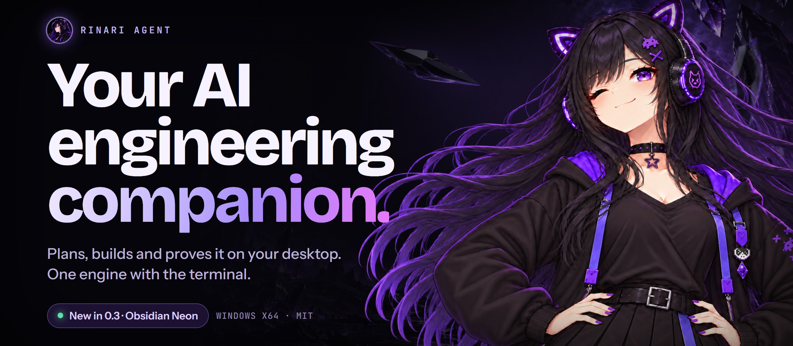</a>

# Rinari Agent

**Your AI engineering companion, on your desktop.**<br>
She reads your repo, does the work and shows you the evidence, in a workspace you can follow step by step.

[](https://github.com/Xainner/Rinari-Agent/releases/latest)
[](https://github.com/Xainner/Rinari-Agent/actions/workflows/agent-ci.yml)
[](LICENSE)


[**Download**](https://github.com/Xainner/Rinari-Agent/releases/latest) · [rinari.ai](https://rinari.ai) · [What's new](#whats-new-in-03) · [Install](#install) · [Build from source](#build-from-source) · [Rinari CLI](https://github.com/Xainner/Rinari-CLI)

</div>

<br>

<p align="center">
  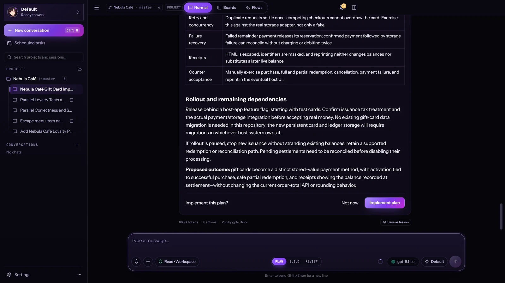
  <br><sub>Every image below the banner is a real capture of Rinari Agent 0.3.1. The project is a demo café app.</sub>
</p>

## What's new in 0.3

**Obsidian Neon.** Every screen is redesigned around ink black and the neon violet of Rinari's headphones, with glass surfaces, motion that follows what is actually happening and Rinari's art where it helps. The workspace also learned new tricks:

<table>
<tr>
<td width="50%" valign="top">

### Several folders. One project.
An app and its website in one project, each folder with its own branch and trust. The **New project** window gathers name, description, folders, profile and a summary before anything is created.

</td>
<td width="50%" valign="top">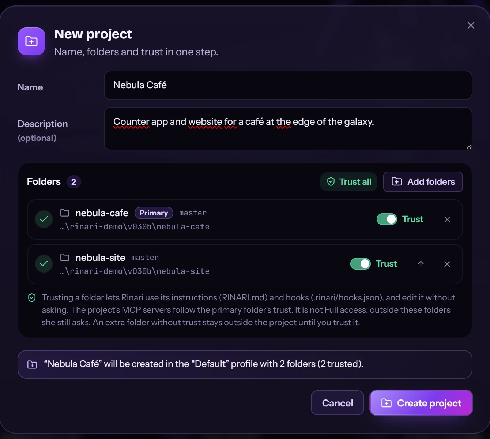</td>
</tr>
<tr>
<td colspan="2">

### A live checklist
For multi-step work she keeps a checklist above the composer: what is done, what is in progress, what is left. You can steer her mid-turn without stopping the run.

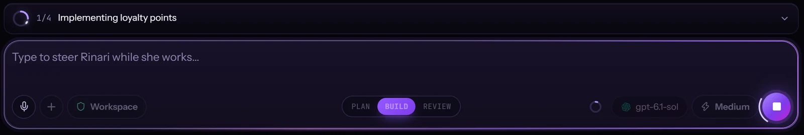

</td>
</tr>
<tr>
<td colspan="2">

### She remembers what matters
When she learns something worth keeping, a card shows up in the chat. You choose whether she asks first or remembers on her own, and review everything in **Settings → Memory**. Export and import included.

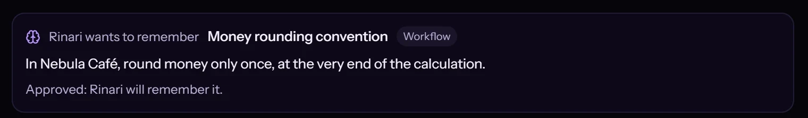

</td>
</tr>
<tr>
<td valign="top">

### And leaves you notes
Spotted something outside the task? She pins a note. Showing it does nothing; accepting it opens a new conversation with that task.

</td>
<td valign="top" align="center">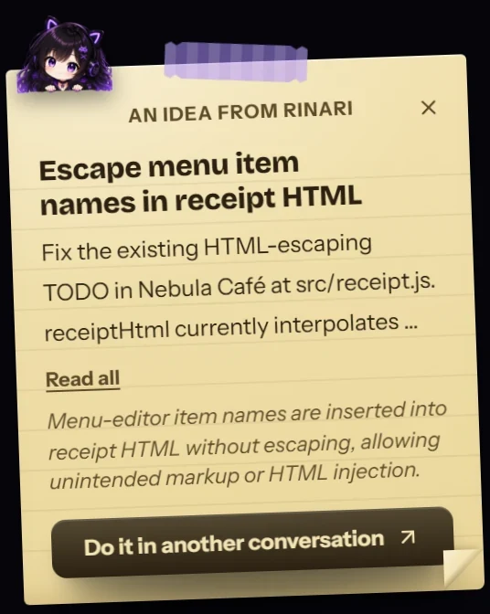</td>
</tr>
<tr>
<td valign="top">

### Profiles become workspaces
Each profile keeps its own projects and conversations. Switch from the sidebar header; everything you already had lives in **Default**.

</td>
<td valign="top" align="center">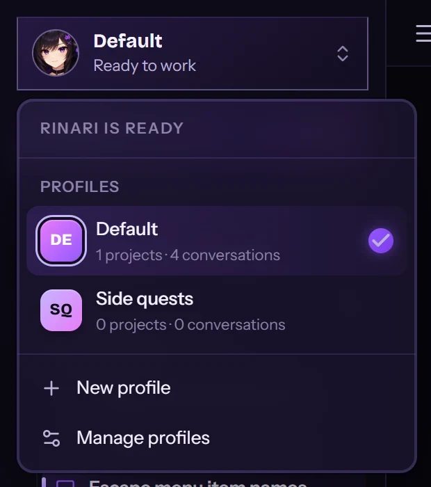</td>
</tr>
<tr>
<td colspan="2">

### Talk to her, locally
`Ctrl+Space` and speak. whisper.cpp transcribes on your computer; no audio is sent to any service.

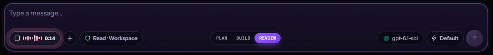

</td>
</tr>
</table>

Also in 0.3: **Full access** asks for confirmation and explains what it allows, remote MCP servers with bearer tokens and headers, visible retries and **Continue** after a provider limit, persistent logs with **Export diagnostics**, and a skills manager with **Save as lesson**. The full list is in the [release notes](https://github.com/Xainner/Rinari-Agent/releases).

> [!IMPORTANT]
> **Updating from 0.2?** The first time 0.3 opens, Rinari's database moves to a new schema. Your conversations, projects and providers are kept, but 0.2.x can't reopen that data afterwards.

## Plan. Build. Review. Your call.

Pick how she approaches the task. The engine applies the permissions that go with each mode.

<table>
<tr>
<td width="33%" valign="top"><b>PLAN</b> · plans first, touches nothing.<br><sub>She ends with “Implement this plan?” and waits for you.</sub></td>
<td width="33%" valign="top"><b>BUILD</b> · does the work and runs the checks.<br><sub>In this capture: 13 tests pass, plus syntax and diff checks.</sub></td>
<td width="33%" valign="top"><b>REVIEW</b> · reads, verifies, reports.<br><sub>Here an arithmetic check confirms a real rounding defect. No files modified.</sub></td>
</tr>
<tr>
<td colspan="3">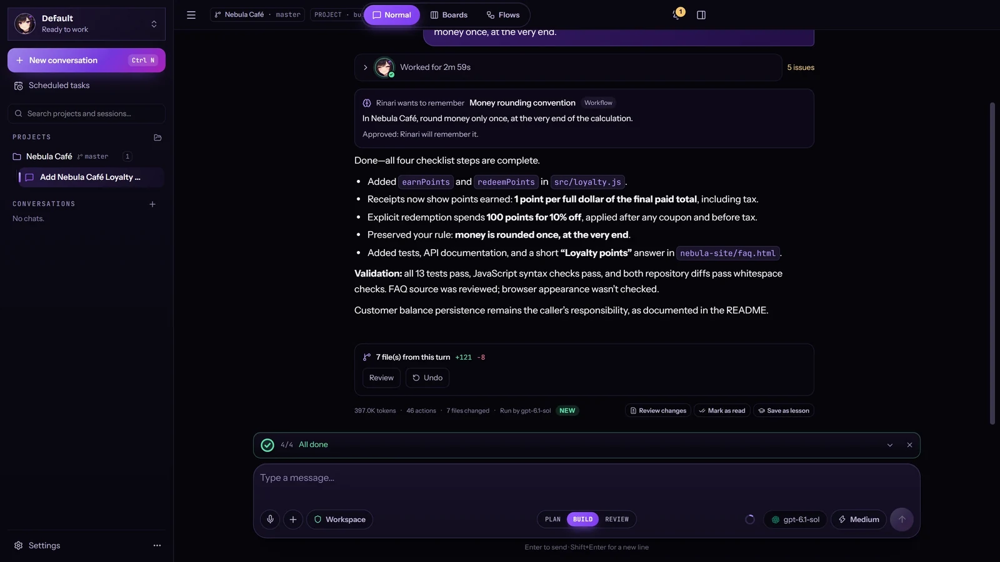</td>
</tr>
</table>

## She shows her work

Tool calls, approvals, evidence and diffs sit next to the conversation: observable activity, not a story about it.

<table>
<tr>
<td colspan="2">

**Your changes? She asks first.** Risky actions wait for you with the risk level and the exact path: deny, allow once or allow in this chat.<br>
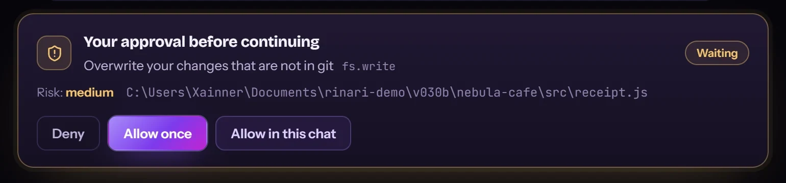

</td>
</tr>
<tr>
<td width="50%" valign="top">

**Every claim, with evidence.** Tests, diff checks and syntax checks are recorded in the Verification panel, each with its command and result.<br>
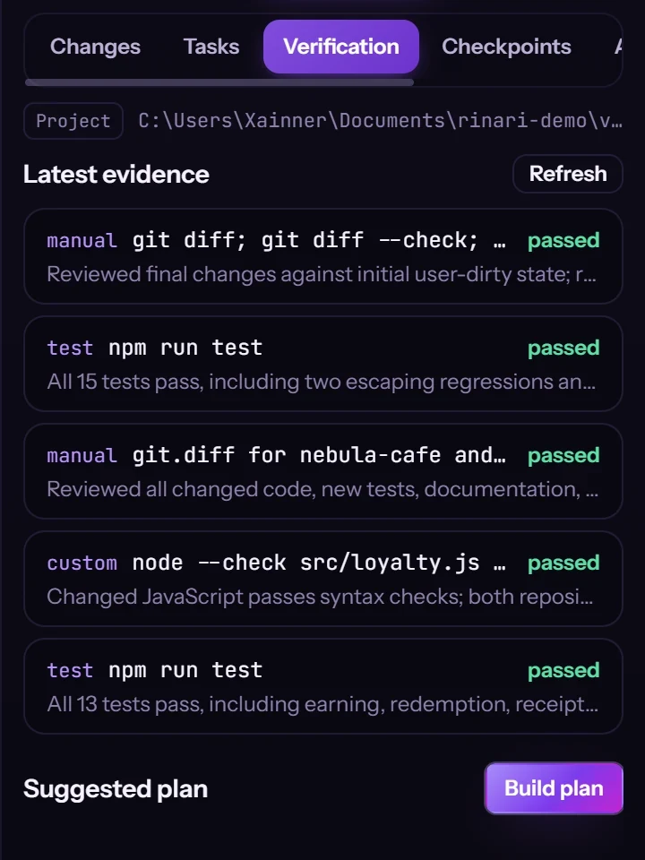

</td>
<td width="50%" valign="top">

**Subagents, in parallel.** Two read-only reviewers at once. She waits, merges and gives you one verdict.<br>
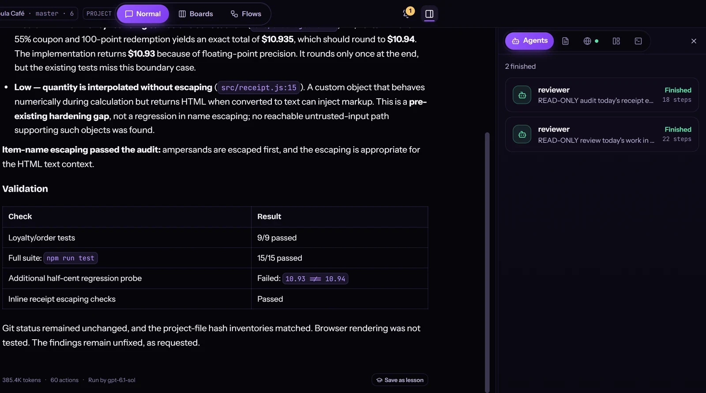
<br><br>

**Full access explains itself.** Before you turn it on, she lists what it allows and what she will still ask about.<br>
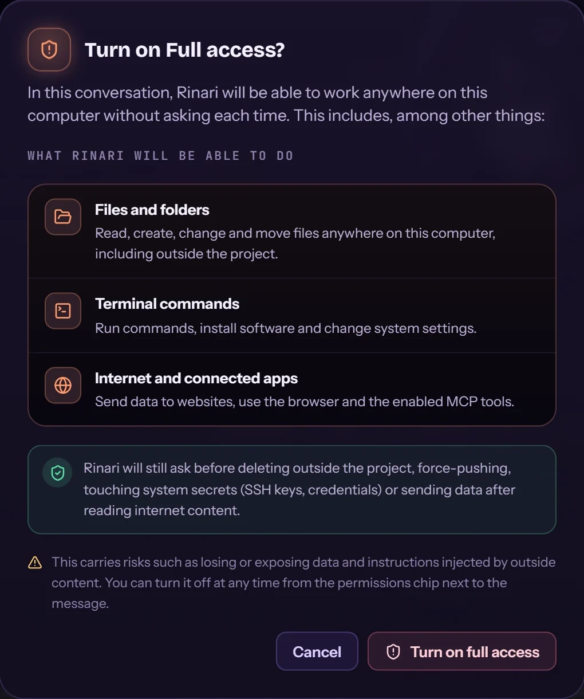

</td>
</tr>
</table>

**Boards** puts several conversations in one window, each with its own project, model and chat (`Ctrl+Shift+B`). **Flows** lays a session out as its stages, with turns, time and the agents involved.

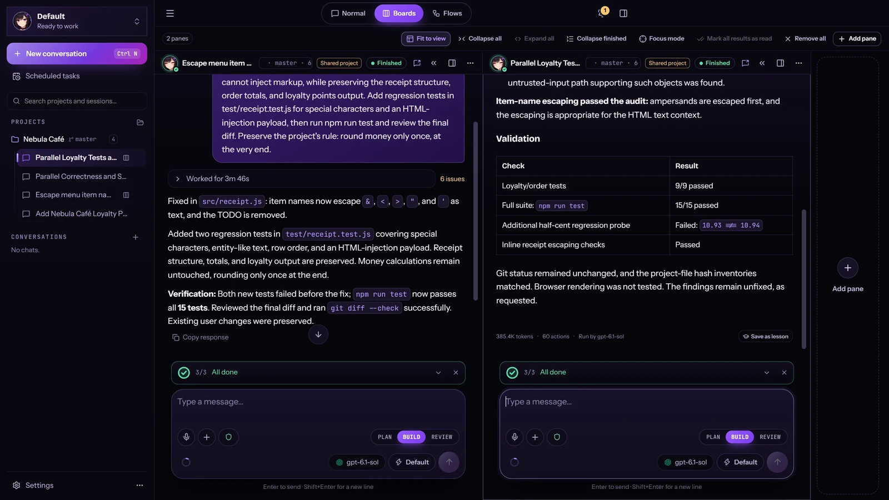

## Your models. Her personality.

| Setting | What you get |
| :--- | :--- |
| **Providers** | Presets for OpenAI, Anthropic, Ollama, LM Studio and OpenCode Go, plus any OpenAI-compatible endpoint. Test the connection, discover models, pick one per chat and per agent. Claude Subscription is available as an experimental opt-in in **Settings → Providers**. |
| **Reasoning** | A slider from the fastest level up to **Ultra** on models that support it. Levels depend on the model and provider. |
| **Personality** | **Minimal**, **Balanced** or **Full character**. It changes how much of her shows in the answers, never what she can do or how she reports results. |
| **Tools** | File attachments with OCR and vision where supported, `@` workspace search, MCP servers (stdio and remote), skills, plugins and an embedded browser you can take over. |
| **Comfort** | English and Spanish, keyboard shortcuts, a command palette, sounds and reduced motion. |

<table>
<tr>
<td width="55%" valign="top">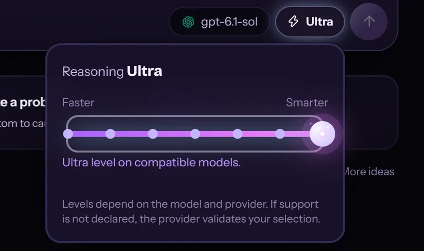</td>
<td width="45%" valign="top">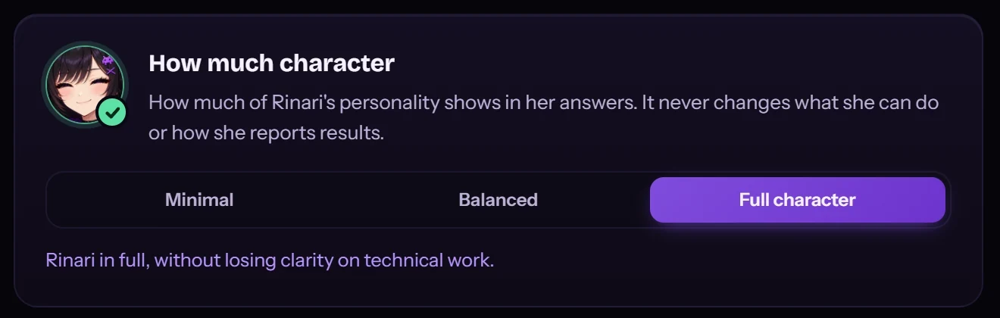<br><br>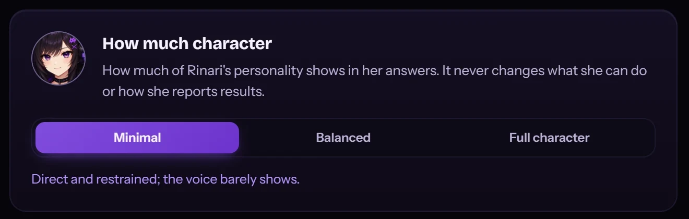</td>
</tr>
</table>

You bring the provider connection. Remote providers may charge for usage; local models need a running compatible server and suitable hardware. Tool calling, vision and reasoning levels vary by model.

## Install

1. **Download** `Rinari-Agent-Setup-<version>-x64.exe` from the [latest release](https://github.com/Xainner/Rinari-Agent/releases/latest).
2. **Run the installer.** Install **only for you** or **for all users** (needs administrator permission), with shortcuts if you want them. Tick **Add Rinari CLI to PATH** to use `rinari` from any terminal (it is off by default).
3. **Connect a model** in **Settings → Providers**: test the connection and pick a model.
4. **Open a project**, choose PLAN, BUILD or REVIEW and describe the outcome you want.

The installer isn't code-signed yet, so Windows SmartScreen may ask you to confirm.

**Updating.** The app tells you when a new release is out. From a terminal, `rinari update` updates the app and the CLI together (`--check` only reports; `--desktop-only` and `--cli-only` narrow it).

## One engine. Two ways to work.

The desktop doesn't duplicate the agent runtime. [Rinari Engine](https://github.com/Xainner/Rinari-CLI) owns execution, sessions, model routing, approvals, credentials and state; Rinari Agent makes that state visible. Start a task in the terminal and continue the **same session** on the desktop:

```bash
rinari desktop . --session <id>
```

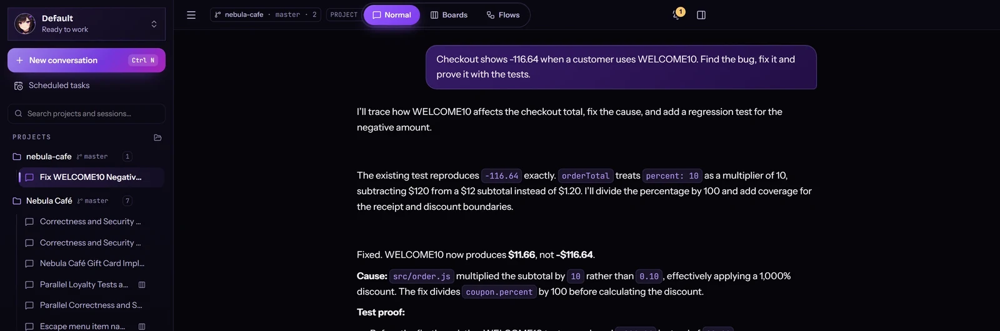

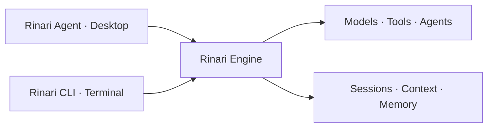

The desktop is **React 19 + TypeScript + Electron**. A sandboxed preload exposes a narrow platform contract, and a versioned NDJSON protocol over stdio connects the Electron main process to the Python engine. The compatible engine revision and required capabilities are pinned in [engine-manifest.json](engine-manifest.json).

## Know the boundaries

- **A workspace for agent work, not a full IDE.** Edit code in your editor; follow, approve and verify the work here.
- **Local app, not necessarily offline.** Cloud models and external tools send data to the services you configure. Credentials are owned by the engine, never stored in the renderer.
- **Capabilities are explicit.** Attachments have size and page limits; OCR and vision have their own requirements ([attachments, OCR and vision](docs/attachments.md)).
- **Evidence is not a guarantee.** Verification shows what was checked. Review diffs and results before relying on them.
- **Windows x64 first.** Other platforms need release-specific validation.

## Build from source

You need Node.js 22.12+, npm 10 and a [Rinari CLI](https://github.com/Xainner/Rinari-CLI) checkout at the revision in [engine-manifest.json](engine-manifest.json). Running the engine from source also needs Python 3.11+ and uv.

```bash
git clone https://github.com/Xainner/Rinari-Agent.git
cd Rinari-Agent
npm ci
```

Point the native host at your engine checkout (PowerShell):

```powershell
$env:RINARI_ENGINE_BIN = "uv"
$env:RINARI_ENGINE_ARGS = "run rinari"
$env:RINARI_ENGINE_CWD = "C:\dev\Rinari-CLI"
npm run desktop:dev
```

Local dictation from a source build needs `RINARI_WHISPER_BIN` pointing to a `whisper-cli.exe` (the installer ships one). A Vite-only preview is not a substitute for the native host and engine.

<details>
<summary><strong>Checks and Windows packaging</strong></summary>

```bash
npx vitest run
npm run build
npm run typecheck:electron
npm run protocol:check
npm run parity:check
npm run ui:e2e -- <scenario>
```

`npm run ui:e2e -- ui-tour` captures every surface of the app. Protocol checks need the matching engine schema: when the contract changes, update the engine first, regenerate the desktop types and validate both repositories.

```powershell
powershell -ExecutionPolicy Bypass -File scripts/package-engine.ps1 -CliRepo C:\dev\Rinari-CLI -OutDir engine-dist
npm ci --prefix installer/setup
npm run package:win
```

See the [packaging decision](docs/adr/0001-engine-packaging.md) and the [release guide](docs/releases.md).

</details>

## Go deeper

[Architecture and contributor rules](AGENTS.md) · [Obsidian Neon design system](docs/design/obsidiana-neon.md) · [Activity timeline](docs/activity-timeline.md) · [Agents and browser](docs/agents-and-browser.md) · [Background processes](docs/background-processes.md) · [Release guide](docs/releases.md) · [Docs on rinari.ai](https://rinari.ai/docs/)

Found a bug? [Open an issue](https://github.com/Xainner/Rinari-Agent/issues) with your app and engine versions, the steps to reproduce it and an exported diagnostic (**Settings → About → Export diagnostics**; it doesn't include your conversations). Never include provider keys or private project data.

---

<div align="center">

**Bring the idea. Keep sight of the work.**

[Download](https://github.com/Xainner/Rinari-Agent/releases/latest) · [rinari.ai](https://rinari.ai) · [Rinari CLI](https://github.com/Xainner/Rinari-CLI) · [MIT License](LICENSE)

<sub>The banner is brand artwork; every other image is a real capture of the app.</sub>

</div>
