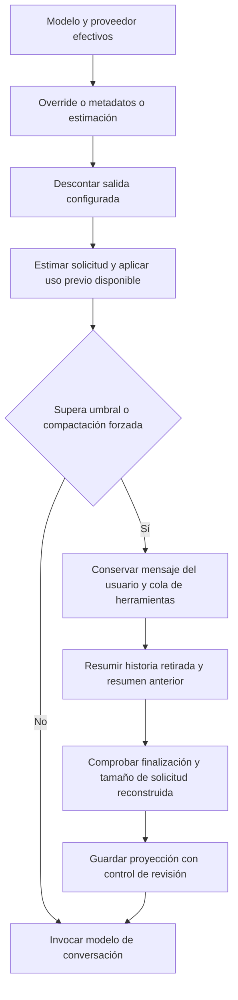

# Contexto y compactación: revisión y plan de ejecución

Fecha: 2026-09-21. Estado: propuesta; implementación pendiente.

## Alcance y conclusión

Revisión del working tree de Rinari-Agent (`39368e0`, con cambios concurrentes) y del motor local Rinari-CLI (`40c0089`). Se inspeccionaron ajustes, contrato, adaptadores, preparación de solicitudes, persistencia, recuperación y pruebas. `context/preparation.py` del motor empaquetado coincide por SHA-256 con el código fuente revisado.

La automatización ya existe parcialmente. El problema combina cobertura insuficiente de detección, procedencia incorrecta en algunos límites, una interfaz que prioriza la configuración manual y ausencia de una evaluación suficiente de continuidad. Rediseñar solo la pantalla dejaría estos problemas activos.

Esta revisión no modifica código de producto ni configuración de usuarios. La evaluación visual se basa en componentes y estilos; queda pendiente inspección de la pantalla renderizada en Electron. No se hicieron llamadas de pago a modelos ni se compactaron conversaciones reales.

## Flujo actual

El umbral predeterminado es 80% de capacidad utilizable de entrada. El objetivo posterior es 60%, o 75% del umbral si este es menor. Son valores actuales, no una demostración de que sean óptimos para todos los modelos.

Se conserva una base valiosa:

- Historial original intacto; la proyección guarda los IDs cubiertos y un resumen acumulativo.
- Persistencia anterior al reemplazo en memoria y comprobación de cambios concurrentes.
- Protección del último mensaje del usuario y conservación de bloques de llamadas/resultados.
- Rechazo de resúmenes vacíos, truncados o con llamadas a herramientas.
- Cancelación y fallos de persistencia sin publicar una nueva proyección.
- Un reintento reducido ante un desbordamiento reconocido del proveedor; un timeout no se interpreta como desbordamiento.
- Compactación manual separada de la ejecución de la tarea, con bloqueo de turno.

## Hallazgos priorizados

### P1 — Detección automática incompleta y procedencia incorrecta

El resolver consulta `list_models`, normaliza campos y usa una caché por proveedor, endpoint y modelo. Cuando no encuentra ventana, recurre a 128.000 tokens. No hay una cadena general de catálogo por proveedor/modelo y consultas específicas a servidores locales en este módulo.

Hay una pérdida concreta en `src/rinari/providers/adapters/responses.py:99`: `list_models` conserva IDs y disponibilidad, pero descarta los demás metadatos de cada entrada. Otros adaptadores sí llaman a `normalize`. Si un endpoint compatible con Responses anuncia su contexto, esta vía no lo aprovecha.

Además, `src/rinari/context/settings.py:67` decide la procedencia por la presencia de cualquier límite. Reproducción aislada: discovery devuelve únicamente `max_output_tokens=4096`; el resultado es `window_tokens=128000`, `window_source=model_metadata`, `window_estimated=false`. Es un respaldo presentado como dato conocido.

`ModelService.refresh` actualiza disponibilidad, sin renovar capacidades guardadas. Consultar repetidamente desde ajustes puede seguir usando la caché; la UI no dispone de una invalidación explícita.

Consecuencia: compactación prematura en modelos grandes, desbordamiento en modelos pequeños y una interfaz que no permite saber cuándo confiar en el número.

### P1 — Se acepta un resumen sin comprobar fidelidad

En `src/rinari/context/preparation.py:209` y `:236` se comprueban terminación, ausencia de tool calls y reducción de tamaño. No se comprueba que el resumen conserve restricciones, decisiones, trabajo pendiente o incertidumbres.

Reproducción con un caller falso: un resumen que dice «Everything is complete. No pending work.» se guarda pese a que el historial pide implementar una exportación. Esto demuestra la ausencia de una barrera de fidelidad; no mide la frecuencia con que un proveedor real cometería ese error.

El smoke real existente comprueba que sobrevive una decisión de color, usando además una ventana manual de 8.000. Es evidencia útil de integración, pero no valida autodetección ni continuidad de una tarea extensa.

### P1 — Las compactaciones sucesivas debilitan el estado estructurado

En `preparation.py:217` los campos estructurados se extraen de `ctx.history`, que ya es la cola activa después de una compactación previa. No se fusionan los campos estructurados anteriores. El resumen de texto sí se transmite al siguiente resumen.

Reproducción aislada de dos compactaciones: la primera conserva el objetivo de exportación y «Never change the database schema»; en la segunda desaparecen las restricciones estructuradas y el objetivo cambia al primer mensaje de la cola. La supervivencia de esa restricción pasa a depender del resumen libre.

También conviene corregir la calidad de estas evidencias: `extract_from_history` usa recortes de texto y marcadores, y deriva archivos cambiados de llamadas solicitadas, sin comprobar aquí su resultado. El estado de tareas y verificaciones debe venir de registros autorizados y tener su alcance de sesión/proyecto explícito.

### P2 — Contabilidad y estado visible no comparten una única medida

`context/tokens.py` usa caracteres/4 y cuenta texto y herramientas, sin estimación general del coste de imágenes. `AgentLoop` calibra con el uso anterior, pero `context_usage` vive en `AgentContext`; su construcción al reabrir no restaura ese dato.

El snapshot de CLI (`src/rinari/cli/snapshot.py:183` y `:205`) estima solo historia y obtiene la ventana desde capabilities, sin el mismo resolver de preflight ni su reserva de salida. Esto permite discrepancias con el cálculo que dispara compactación. No se afirma que todos esos valores se estén mostrando hoy en Agent.

El contrato generado `ContextStatus` declara ventana, procedencia y estimación; omite incluso `total_window_tokens`, que el motor ya devuelve. Faltan capacidad utilizable de la sesión, reserva de salida, antigüedad de metadatos y progreso/resultado de continuidad.

### P2 — Ajustes expone mecanismos antes que información útil

En `src/components/settings/ContextSettings.tsx`:

- Cada modelo aparece dos veces: campo manual y botón independiente de consulta.
- «Automático» es un placeholder; no se muestra el valor detectado al abrir la pantalla.
- No hay resumen de sesión, uso, fuente, vigencia ni última compactación.
- Checkbox, número, select y enlaces tienen poca jerarquía; el componente añade padding dentro de un shell que ya lo aporta.
- Faltan estados dedicados de carga inicial, lista vacía, consulta en curso y error por modelo.
- El botón solo se bloquea durante guardado. Los límites HTML no impiden este envío programático; no hay validación previa ni gestión completa de cambios pendientes.
- La actividad conserva estados útiles, pero muestra métricas con un inspector genérico; no explica qué se preservó ni qué validación se realizó.

## Qué tomar de Hermes

Su [resolver público de metadatos](https://github.com/NousResearch/hermes-agent/blob/main/agent/model_metadata.py) combina overrides, caché, consultas específicas a endpoints/proveedores, catálogo y respaldos. Mantiene excepciones por destino: el nombre del modelo por sí solo no identifica la capacidad disponible. También conserva configuración manual para casos especiales.

Su [documentación de compactación](https://hermes-agent.nousresearch.com/docs/developer-guide/context-compression-and-caching/) describe uso reportado por el proveedor, anclas persistentes, protección de cola y controles de reintentos. Son referencias para mejorar Rinari, no evidencia de compresión universalmente óptima ni motivo para copiar todos sus umbrales o subsistemas.

## Experiencia propuesta

Mantener tokens visuales, tipografía y componentes existentes de Rinari. Aplicar jerarquía y divulgación progresiva; no introducir otro sistema visual.

| Superficie | Contenido principal | Acciones |
| --- | --- | --- |
| Ajustes: comportamiento | Compactación automática activa; explicación breve de continuidad | Activar/desactivar; modelo de conversación como resumidor predeterminado |
| Ajustes: modelos | Una fila por modelo, proveedor, capacidad efectiva, fuente y estado | Actualizar detección; buscar/filtrar; abrir detalles |
| Ajustes: avanzado | Umbral, resumidor alternativo y límite personalizado por destino | Editar; volver a automático; guardar/restablecer |
| Conversación: contexto | Uso real o estimado, presupuesto utilizable y punto de compactación | Ver desglose y compactar ahora |
| Conversación: última compactación | Antes/después, duración, estado y resumen de lo preservado | Ver detalles; reintentar si falló |

Ejemplo ilustrativo, sin datos reales: «Contexto automático · 200.000 tokens · informado por el proveedor». Si falta información: «Capacidad sin confirmar · usando estimación», sin presentar el respaldo como detección.

Las preferencias globales viven en ajustes; el consumo y la continuidad pertenecen a la sesión. El diseño debe permitir ambos sin exigir una sesión abierta para configurar modelos. Abrir ajustes no lanza inferencias ni sondeos de pago.

## Plan de ejecución

### Entrega A — Resolver autoritativo de capacidad (Engine)

1. Añadir regresiones para procedencia incorrecta, metadatos descartados, límites solo de entrada/salida y overrides existentes.
2. Unificar resolución por proveedor + endpoint + modelo + transporte y, donde afecte, perfil/configuración del servidor. Distinguir ventana total, máximo de entrada y máximo de salida.
3. Incorporar metadatos normalizados en todos los adaptadores aplicables y discovery específico para destinos locales soportados. Separar máximo teórico del modelo de capacidad cargada/configurada.
4. Usar un catálogo versionado por proveedor/modelo cuando el endpoint no informe límites, con procedencia y fecha. No inferir un límite confirmado por coincidencias amplias de nombres. Elegir catálogo y condiciones de distribución durante esta entrega.
5. Mantener overrides explícitos y respaldo identificado. No borrar valores manuales existentes al migrar; explicar cómo volver a automático.
6. Caché compartida de discovery por destino, deduplicación de solicitudes, refresco explícito y comportamiento offline. Los fallos de discovery no deben convertirse en datos confirmados.

Orden de preferencia propuesto: override explícito → capacidad efectiva confirmada del destino → metadatos del proveedor → catálogo específico → respaldo estimado. Al combinar límites, aplicar las restricciones más estrechas del contrato. La caché conserva la procedencia, no constituye una fuente superior por sí sola.

Aceptación: una fixture de endpoint que anuncia 64k produce 64k tanto en preflight como en el estado visible; cambiar de endpoint invalida el resultado anterior; metadatos solo de salida nunca confirman una ventana; todos los adaptadores soportados tienen cobertura documentada.

#### Caso concreto: OpenCode y GLM-5.3-Flash (aclaración 2026-09-22)

La detección debe enriquecer también capacidades, no solo ventanas: visión, herramientas, razonamiento y límites de salida, distinguiendo conocido, no soportado y desconocido. Compartir los metadatos con el enrutamiento visual existente; no crear otro runtime de visión.

El [catálogo models.dev](https://models.dev/api.json), consultado el 2026-09-22, declara para `opencode/glm-5.3-flash` y `opencode-go/glm-5.3-flash` contexto de 1.000.000 tokens, salida máxima de 131.072, entrada de imagen y soporte de herramientas/razonamiento. La [definición base](https://github.com/anomalyco/models.dev/blob/dev/models/zhipuai/glm-5.3-flash.toml) documenta esas capacidades. Son datos del catálogo; esta consulta no valida el endpoint autenticado del usuario ni el soporte de todos los formatos en Rinari.

Criterio de aceptación añadido: con ese proveedor/modelo ya guardado y sin override, cargar contexto y visión automáticamente desde metadatos del destino o catálogo; mostrar la fuente y aplicar cualquier restricción confirmada del endpoint. La ventana total y el máximo de salida son límites distintos: no reservar automáticamente toda la salida máxima si la solicitud no la configura. No exigir recrear el proveedor ni escribir un millón de tokens manualmente.

### Entrega B — Continuidad verificable (Engine)

1. Evolucionar la proyección de manera versionada: objetivo vigente, restricciones activas, decisiones reemplazadas, trabajo completado/pendiente, bloqueos, verificaciones y referencias recuperables, con origen y revisión.
2. Fusionar el estado anterior con la nueva evidencia. Una corrección explícita del usuario debe poder sustituir una decisión antigua; preservar no significa congelar instrucciones obsoletas.
3. Usar estado autorizado de tareas, herramientas y verificaciones para hechos operativos. El resumen narrativo no puede declarar una prueba exitosa ni otorgar permisos.
4. Mantener el último pedido y bloques íntegros; guardar resumen anterior + estado estructurado + cola como entrada de continuación. Resolver campos vacíos, contradicciones y referencias que ya no existen.
5. Validar estructura, procedencia de hechos críticos, coherencia con registros, reducción y margen restante antes de publicar. Un validador determinista no demuestra fidelidad semántica total; complementarlo con evaluación de continuación.
6. Ante fallo de validación, conservar la proyección anterior. Permitir como máximo una reparación acotada dentro del presupuesto y registrar el motivo; impedir ciclos repetidos sin reducción útil.
7. Persistir anclas de uso ligadas al destino y a la revisión del contexto; invalidarlas tras cambios de modelo, prompt, herramientas, edición o compactación cuando deje de ser válida su base.

Aceptación: tras tres compactaciones y un reinicio sobreviven los hechos críticos del corpus; un resumen contradictorio con tareas pendientes no se publica como válido; fallos/cancelación mantienen la proyección anterior. Conservar la compatibilidad con estados existentes.

### Entrega C — Contrato común de estado y diagnóstico (Engine → Agent)

Extender de forma aditiva `context.status` y eventos/snapshots. Definir nombres definitivos en el esquema del Engine y regenerar tipos; no editar manualmente `protocol.generated.ts`.

Datos necesarios: identidad del destino; límites total/entrada/salida; reserva de salida; capacidad utilizable; fuente y vigencia; consumo y tipo de medición; umbral/objetivo; operación actual; última compactación con revisión, antes/después, duración y resultado de validaciones realmente ejecutadas. Añadir consulta agrupada o caché eficiente para el catálogo de ajustes.

La UI debe distinguir «validación estructural aprobada» de «continuidad evaluada»; no inventar un porcentaje de calidad. Resumen completo solo bajo demanda mediante el contrato y Artifact Store cuando corresponda. El snapshot debe reconstruir el estado sin depender de haber visto todos los eventos.

Aceptación: Engine, CLI y Agent usan la misma capacidad efectiva y la misma base de consumo; compatibilidad de protocolo y reconexión verificadas.

### Entrega D — Ajustes y observabilidad de sesión (Agent)

Implementar las superficies propuestas con carga automática y campos manuales dentro de avanzado. Añadir validación, estados de carga/error/vacío, cambios pendientes y retorno explícito a automático. Reutilizar componentes de controles, tarjetas, tipografía e i18n.

Mostrar compactación como actividad legible con progreso por etapa, métricas antes/después y detalles de preservación disponibles. Compactación manual y reintento deben mantener el bloqueo y la semántica de operación de contexto.

Aceptación: elegir un modelo conocido no exige escribir tokens ni consultar cada fila; navegación por teclado y lectura accesible; temas claro/oscuro y ventana estrecha comprobados en Electron; fallos parciales de discovery no bloquean toda la pantalla.

### Entrega E — Evaluaciones y entrega integrada

| Grupo | Casos obligatorios | Evidencia de éxito |
| --- | --- | --- |
| Detección | Responses, Chat Completions, Anthropic, compatible sin metadatos, servidor local limitado, caché vencida, mismo nombre en dos destinos | Capacidad y procedencia correctas; sin ventanas ficticiamente confirmadas |
| Continuidad | Cambios de objetivo, restricciones negativas, decisiones corregidas, tarea interrumpida, pruebas fallidas, varios proyectos/agentes | Próxima acción correcta y hechos críticos preservados |
| Historial largo | Tres o más compactaciones, resumen anterior grande, mensajes enormes, español/código/JSON | Reducción útil sin deriva crítica ni compactación en bucle |
| Herramientas y medios | Bloques call/result, resultados parciales, artefactos, imágenes, adjuntos | No quedan resultados huérfanos; referencias recuperables |
| Recuperación | Reinicio, cancelación, disco fallando, cambio concurrente, overflow real, timeout, cambio a modelo menor | Sin pérdida del original, sin efectos duplicados, reintentos acotados |
| UI/contrato | Carga, errores, override/automático, cambio de modelo, reconexión | Misma información en ajustes, sesión y motor |

Comparar continuación con historial completo frente a continuación compactada: siguiente acción, conservación de restricciones, pendientes, decisiones, referencias, tokens, coste, latencia y frecuencia de compactación. Usar casos con hechos esperados y varias ejecuciones para modelos reales; un juez LLM puede complementar, nunca ser la única evidencia.

Criterio propuesto: 100% de invariantes críticos deterministas, cero afirmaciones operativas inventadas en el corpus de aceptación y ausencia de regresión de continuidad frente a la línea base. Fijar objetivos de latencia/coste tras medir esa línea base; no prometer una calidad universal ni cambiar 80/60 a otro umbral por imitación.

Publicar primero Engine y contrato; después actualizar el pin y paquete de Agent. Validar el paquete real de Electron, no solo el checkout Python. Cada entrega debe tener un commit/PR acotado y pruebas apropiadas. Antes de ejecutar, volver a inspeccionar los cambios concurrentes y el estado de las ramas.

## Validación realizada en esta revisión

- Engine: `.venv/Scripts/python.exe -m pytest tests/unit/test_context_preparation.py tests/unit/test_context.py tests/unit/test_context_retrieval.py -q` → **35 passed**.
- Agent: `npm test -- src/components/settings/ContextSettings.test.tsx src/features/activity/turnTimelineReducer.test.ts` → **30 passed, 4 archivos** según el runner.
- Tres comprobaciones adicionales en un home temporal, usando el setup de `test_context_preparation.py` y callers falsos: procedencia errónea con metadatos solo de salida; aceptación de resumen infundado; pérdida de restricciones estructuradas en la segunda compactación. No se añadieron tests ni se modificó estado de usuarios.

Las pruebas aprobadas acreditan las protecciones actuales. No contradicen los hallazgos: esos escenarios no están cubiertos por sus aserciones. El siguiente paso de implementación es convertir las reproducciones en regresiones permanentes en Engine, antes del rediseño visual.
